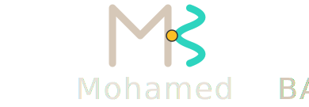
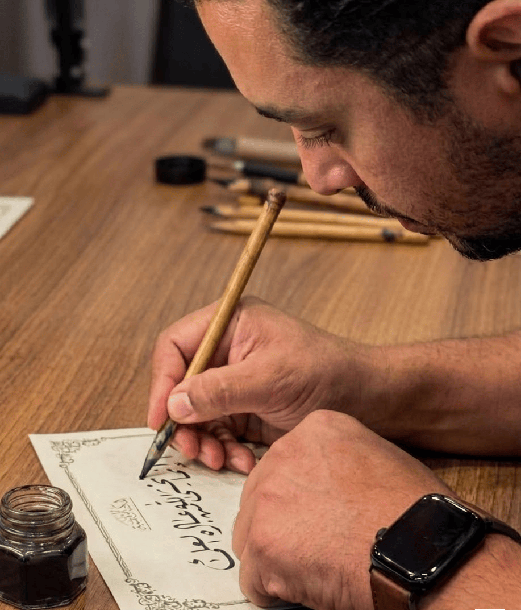
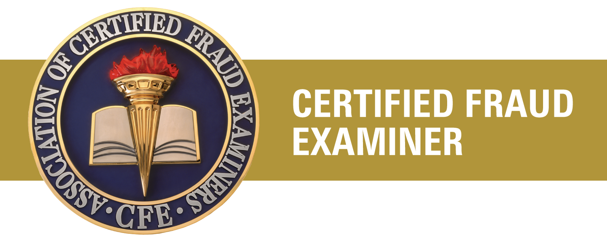

::: {#hero-heading}

{.author-logo .light-content}
{.author-logo .dark-content}

CIA · CFE · DATA SCIENTIST

::: {.grid}
::: {.g-col-12 .g-col-md-6}
The [Berkeley MIDS](https://ischoolonline.berkeley.edu/data-science/curriculum/){target="_blank"} from the [School of Information](https://www.ischool.berkeley.edu/){target="_blank"} provided the formal mathematical foundations for my work. I now integrate this academic rigor with my background as a FP&A manager, CIA and CFE to build ML, GenAI, and statistical inference solutions for clients.

Arabic calligraphy is my parallel practice a discipline that demands the same focus: finding precise, geometric structure within apparent freedom.
:::
::: {.g-col-12 .g-col-md-6}
[{fig-alt="A professional close-up photograph of Mohamed Bakr in profile, deeply focused on performing traditional Arabic calligraphy with a reed pen (Qalam) and black ink. He is writing the Quranic verse: 'إنما يخشى الله من عباده العلماء' ('Those truly fear Allah, among His Servants, who have knowledge' — Fatir:28) in Ruq'ah script. The photo also features a traditional ink well positioned on the parchment." .about-image}](https://www.instagram.com/mbakr84/){target="_blank" rel="noopener noreferrer"}
::: 

:::
::: 

## What I Do

::: {.grid}

::: {.g-col-12 .g-col-md-6}

The problems I find most compelling are those where domain fluency dictates the model’s architecture, not just its tuning. In fraud examination, understanding the mechanics of a disbursement scheme determines which features must be engineered. In FP&A, knowing how a budget is structurally assembled determines which residuals actually deserve attention.

I build fast, test adversarially, and refuse to deploy until I understand what a model has actually learned—beyond just passing its performance metrics. This habit is a direct inheritance from the world of audit: a clean reconciliation is not just a goal; it is a rigorous test of whether you are capable of catching a well-hidden fraud.
:::

::: {.g-col-12 .g-col-md-6}
In the earlier chapters of my career, I built end-to-end solutions that spans from data ingestion, EDA, cleaning, descriptive modeling, and board-level reporting to evaluate large-scale capital projects and pinpoint the drivers of variance. The job title was "Audit," but the work was data science before it had a name.

I operate most effectively at the intersection of domain expertise and quantitative rigor — where the business problem shapes the equation, and the equation refines the question.
:::

:::

## Education & Credentials

::: {.grid}

::: {.g-col-12 .g-col-md-6}
####  Education

- **M.S. in Information and Data Science**
  *UC Berkeley, USA* · 2025
- **B.Sc. of Commerce, Accounting**
  *Alexandria University, Egypt* · 2004

::: {.cert-badges .edu-badges}
{target="_blank" rel="noopener noreferrer"}
{target="_blank" rel="noopener noreferrer"}
:::
:::

::: {.g-col-12 .g-col-md-6}
####  Certifications

- **Certified Internal Auditor (CIA)** · *The IIA*
- **Certified Fraud Examiner (CFE)** · *ACFE*

::: {.cert-badges}
{target="_blank" rel="noopener noreferrer"}
{target="_blank" rel="noopener noreferrer"}
:::
:::

:::

## Updates

:::: {.grid}

::: {.g-col-12 .g-col-md-6}
#### Projects
::: {#project}
:::
[See all &rarr;](projects.html){.about-links .subtitle}
:::

::: {.g-col-12 .g-col-md-6}
#### Blog
::: {#blog}
:::
[See all &rarr;](posts/index.html){.about-links .subtitle}
:::

::::
